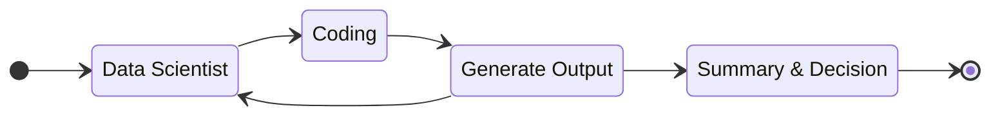
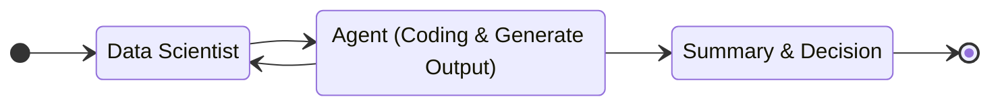

# Data Scientists

<em>Fab 21, tsmc, Arizona, USA</em>

---

# Contents

1. Self Introduction
2. Experiences in Work & Education
3. Data Scientists
4. Summary
5. Q&A

---
layout: section
---

# Who am I?

---
layout: intro
mdc: true
---

# Sean Chang

Coding

DataScience

Photography

Travel

Movie

## Personality

- MBTI: <em>INTJ</em>

## Education

- FJU (B.A. in Economics)
- NTU (Master in Economics)

## Work Experience

- Jr. & Sr. Data Scientist (KKBOX, 2018-2023)
- Jr. & Sr. Software Engineer (tsmc, 2023-current)

## Competitions

- KKBOX InHouse Hackathon (3rd place, 2019)
- IMBD 2020 (1st price, 2020)

---

# Experience in School Life

## Fu Jen Catholic University (FJU, 2011-2015)

- Bachelor's degree in _Economics_
- Faced challenges in:
  - Macroeconometrics and Statistics (failed once)
  - Microeconometrics (failed twice)
  - Chinese (failed three times)
  - Internship: 0

## National Taiwan University (NTU, 2016-2018)

- Master's degree in _Economics_
- Intership & Competitions
  - Yuanta Securities (Develop strategies based on Reinforcement Learning)
  - KKBOX Research & Development Center (Hit Song Prediction)
  - SAS, ATCC, Cathay, ...
- Published research on predictive modeling (Hit-song Prediction)

---

# Experience as a Data Scientist (KKBOX, 2018-2023)

- Developed projects such as:
  - Recommendation systems for personalized music experiences
  - Public opinion systems for artists' career planning
  - Churn detection of KKBOX
- Analyzed user behavior to improve engagement and retention of KKBOX
- Collaborated with cross-functional teams to deploy machine learning models
- Achieved 1st prize in IMBD 2020

---

# Experience as a Software Engineer (tsmc, 2023-current)

- Designed and implemented software solutions for semiconductor manufacturing
  - Workflow Automation System
  - Onduty Dashboard System
  - Parameters Optimization of APC (Advanced Process Control)
- Optimized workflows to enhance production efficiency & save human resources

---
layout: section
---

# Data Scientist

## Oil Well in the 21st Century

---
mdc: true
---

# Data Scientist (Meta)

## Data Scientist, Product Analytics Responsibilities

- Work with large and complex data sets to solve a wide array of challenging problems using different analytical and statistical approaches
- Apply technical expertise with quantitative analysis, experimentation, data mining, and the presentation of data to develop strategies for our products that serve billions of people and hundreds of millions of businesses
- Identify and measure success of product efforts through goal setting, forecasting, and monitoring of key product metrics to understand trends
- Define, understand, and test opportunities and levers to improve the product, and drive roadmaps through your insights and recommendations
- Partner with Product, Engineering, and cross-functional teams to inform, influence, support, and execute product strategy and investment decisions

---
mdc: true
---

# Data Scientist (Meta)(cont.)

## Minimum Qualifications

- Bachelor's degree in Mathematics, Statistics, a relevant technical field, or equivalent
- 2+ years of work experience in analytics and data querying languages (e.g. SQL), scripting languages (e.g. Python), and/or statistical/mathematical software (e.g. R)
- 2+ years of experience solving analytical problems using quantitative approaches, understanding ecosystems, user behaviors & long-term product trends, and leading data-driven projects from definition to execution [including defining metrics, experiment, design, communicating actionable insights]

---
mdc: true
---

# Jobs related to Data Science

<DSRadar />

---

# Day in the Life of Data Scientist

<DayOfDS />

---

# Data Engineering (ETL)

## Extract (E)

Extract unstructured data from sources

## Transform (T)

Unstructured data to structured data

## Load (L)

Save data

---

# Data Engineering (Challenges)

- Extract
  - Many datasources (file, internet, log, etc)
  - Million, billion, even trillion data rows.
  - Crawling, streaming, reading files, ...
- Transform
  - Abilities of data cleaning, transforming, ...
  - Performance, cost, quality, ...
- Load
  - Abilities of database manipulation, storage, ...
  - Database sharding, backup, efficiency, synchronicity, ...
- Additional
  - Monitoring
  - Disaster recovery
  - ...

---
mdc: true
layout: two-cols
---

# Data Engineering (Skills)

- Languages (Programming, Querying)
  - Python: data cleaning, large-scale data manipulation
  - SQL: query, perform database
  - Nice to have
    - Javascript (Typescript): Frontend, Backend
    - Java: Most of Enterprised solutions based on it
- Data
  - Dataframe
  - Distributed computing
    - MapReduce
  - Data warehouse
- Cloud computing
  - Amazon Web Service, Google Cloud Platform, Microsoft Azure
  - Containerization (OS-level virtualization)

::right::

<SkillWordCloud />

---

# Data Engineering (Netflix ETL Pipeline)

- 1 PB = 1,000 (103) TB
- 1 PB = 1,000,000 (106) GB

<em>https://youtu.be/nMyuCdqzpZc?si=bOh2KbHZtkAVUu3t</em>

 

---

# Researching

- Skills
  - Mathematics (Analysis, Statistics, Linear Algebra)
  - Programming
  - English (especially reading)
- Read papers
  - arXiv
  - A+ conferences (KDD, CIKM, NIPS, ...)
- Do experiments
  - Implement/Train/Evaluate models
  - Deal with messy data
- Adopt new tech on products

<em>Attention Is All You Need - Ashish Vaswani, NIPS 2017</em>

---
layout: two-cols
---

# Researching (CIKM, 2019)

::right::

{width=70%}

---

# Researching (Products)

## Scope

- Product analysis
  - Feature
  - Appearence
- User analysis
  - Behavior
  - Metadata
  - Relationship (Personal, Cross-App, ...)

## Tools

- A/B Testing (Z test, t test, ...)
- ML models (Tree-based models, Neural Nets, ...)
- Visualization (Bar, Line, Pie, ...)
- Qualitative research (Questionnaire, Interview, ...)

---

# Presentation

- PoC (Proof of Concept)
  - Basic frontend skills (nice to have)
- Storytelling
  - What do you want to tell to your TA?
  - Drawing facts/conclusions based on your data
- Data Visualization
  - Choose an appropriate chart

---

# AI is Coming!

https://www.anthropic.com/news/the-anthropic-economic-index

https://github.blog/news-insights/research

- 37.2% workers of Computer/Mathematical (USA)
- AI engineers are springing up
  - Vibe Coding
  - More tech debts generated by engineers without software development skills.
- Engineers' feedback
  - 88% feels more productive
  - Developers who used AI completed the task significantly <b>faster–55% faster than</b> the developers who didn’t use

---

# Working Model is Changing

## Before

## After

---

# Become a Supervisor of AI Agent

---
layout: section
---

# Summary

---

# Keep in Mind

## Do's

- Make good use of AI
  - [Prompt Engineering (Google)](https://cloud.google.com/discover/what-is-prompt-engineering)
- Learn things you want to learn
  - T-shaped (π-shaped) talents
- Take actions
  - Internship
  - Competitions
  - Do a side project
  - Implement your ideas
  - Communities (Online, Offline)
  - School clubs

## Don'ts

- Rely heavily on AI
  - Illusion
  - Complex tasks
- Spent all time on studying
- Be all talk

---

# Suggestions for being a Data Scientist

- Get a Master's Degree (at least)
- Learn Python and start a side project
  - Online courses
  - Ask ChatGPT how to achieve things you want to do
- <a href="https://roadmap.sh/ai-data-scientist">DS roadmap</a>
- Hackathon and Data competitions

---
mdc: true
---

<em>各自的模樣 - 理想混蛋</em>

<article>

<b>別努力活成別人期待的樣子</b>

<b>即使曾經有誰說 你應該如何 你如果能夠</b>

我會微笑地看著 你做的選擇

那就已是最美的

那些切實而最深刻 不同卻更繽紛

來自我們真心 渴望擁有的自己的人生

自己的人生

</article>

---

# Contact Me

Feel free to connect with me by scanning the QR codes below:

  

    

    
  

  

    

    
  

  

    

    
  

---
layout: iframe-right
url: https://wall.sli.do/event/5WBstbsDc6e4r8rXCjVGFu
---

# Thank you!
